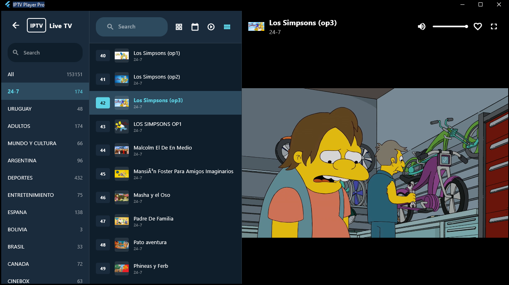

# IPTV Player Pro

**[🇬🇧 English](README_EN.md)** | **🇪🇸 Español**

Una aplicación profesional de reproducción IPTV construida con Flutter, inspirada en TiviMate.


## 📸 Capturas de Pantalla

### Navegación Principal
<div align="center">
  
  
  
</div>

<div align="center">
  
  
</div>

### Detalle de Series y Reproductor
<div align="center">
  
  
</div>

### TEMA NETFLIX
<div align="center">
  
  
  
</div>

## ✨ Características

### 📺 Reproducción
- **TV en Vivo**: Visualiza canales en tiempo real con interfaz de 3 columnas (categorías, canales, reproductor)
- **Películas VOD**: Explora y reproduce películas organizadas por categorías
- **Series**: Navega por temporadas y episodios con información detallada
- **Controles de video avanzados**:
  - Barra de progreso con búsqueda
  - Salto rápido: +10/-10 segundos
  - Control de volumen con deslizador
  - Pistas de audio múltiples
  - Subtítulos configurables
  - **Pantalla completa real** (oculta la barra de tareas de Windows)
  - Atajos de teclado (Espacio, Flechas, F/F11, Escape)

### 🎯 Gestión de Contenido
- **Soporte M3U/M3U8**: Importa playlists desde URL o archivo local
- **Autenticación Xtream Codes**: Compatible con servicios IPTV populares
  - Soporte completo para API Xtream Codes
  - Carga lazy de episodios de series (ultra rápido)
  - Categorías automáticas para Live TV, Movies y Series
- **Múltiples playlists**: Gestiona varias listas simultáneamente
- **Sistema de favoritos**: Marca tus canales y contenidos preferidos
- **Búsqueda avanzada**: Filtra por nombre, categoría o grupo

### 💾 Almacenamiento
- **Base de datos Isar**: Almacenamiento local ultrarrápido y eficiente
- **Caché de contenido**: Reduce tiempo de carga en inicios subsecuentes
- **Sin conexión**: Accede a tu historial y favoritos offline

### 🎨 Interfaz
- **Diseño moderno**: Inspirado en TiviMate con Material Design 3
- **Totalmente Responsivo**: Adaptable a móviles, tablets y escritorio
- **Tema oscuro**: Interfaz optimizada para visualización prolongada
- **Multi-idioma**: Español, Inglés, Chino (简体中文) y Ruso (Русский)
- **Navegación adaptativa**:
  - Móvil: Menú lateral (Drawer)
  - Tablet/Desktop: Barra de navegación completa

### ⭐ Calificaciones
- **Calificaciones inteligentes**: Sistema de 3 capas para obtener ratings
  - OMDb API (sin clave requerida)
  - TMDB API (opcional)
  - Generador pseudo-aleatorio (fallback automático)
- **Indicadores visuales**: Badges con colores según calificación
- **Sin límites**: La app funciona completamente sin configurar APIs

## 🛠️ Tecnologías Utilizadas

- **Flutter**: Framework de UI multiplataforma
- **media_kit**: Reproductor de video basado en libmpv/FFmpeg
- **Isar**: Base de datos NoSQL local de alta velocidad
- **Material Design 3**: Diseño moderno y adaptable
- **Provider**: Gestión de estado reactiva

## 📱 Plataformas Soportadas

| Plataforma | Estado | Notas |
|------------|--------|-------|
| 🪟 Windows | ✅ Completo | Soporte completo con ventana nativa |
| 🤖 Android | ✅ Completo | Diseño responsivo adaptativo |
| 🍎 iOS | ✅ Completo | Compatible (requiere Mac para compilar) |
| 🌐 Web | ⚠️ Limitado | Algunas limitaciones en reproducción de video |
| 🐧 Linux | ✅ Completo | Soporte nativo |
| 🍎 macOS | ✅ Completo | Compatible (requiere Mac para compilar) |

## 📋 Requisitos Previos

### 🪟 Windows
- Windows 10 o superior
- **Modo Desarrollador activado** (requerido para compilar)
  - Ejecuta: `start ms-settings:developers`
  - Activa "Modo de desarrollador"

### 🤖 Android
- Android 5.0 (API 21) o superior
- Mínimo 2 GB de RAM recomendado
- Ver [Guía de Compilación para Android](ANDROID_BUILD.md)

### 🔧 Herramientas de Desarrollo

1. **Flutter SDK**: [Descargar](https://docs.flutter.dev/get-started/install/windows)
   - Extrae en `C:\src\flutter`
   - Agrega al PATH: `C:\src\flutter\bin`

2. **Visual Studio 2022** (Build Tools)
   - Con componente "Desktop development with C++"
   - [Descargar](https://visualstudio.microsoft.com/downloads/)

3. **Verifica la instalación**:
```bash
flutter doctor
```

## 🚀 Instalación y Ejecución

### 1️⃣ Clonar el repositorio
```bash
git clone https://github.com/DiegoRosales123/flutter-iptv-player.git
cd flutter-iptv-player
```

### 2️⃣ Instalar dependencias
```bash
flutter pub get
```

### 3️⃣ Generar código de Isar
```bash
flutter pub run build_runner build --delete-conflicting-outputs
```

### 4️⃣ Ejecutar la aplicación

#### 🪟 Windows

**Modo desarrollo:**
```bash
flutter run -d windows
```

**Compilar Release:**
```bash
flutter build windows --release
```

El ejecutable estará en: `build\windows\x64\runner\Release\iptv_player.exe`

#### 🤖 Android

**Modo desarrollo (conecta tu dispositivo o inicia un emulador):**
```bash
flutter run
```

**Compilar APK:**
```bash
flutter build apk --release
```

El APK estará en: `build\app\outputs\flutter-apk\app-release.apk`

**Para más detalles, consulta la [Guía de Compilación para Android](ANDROID_BUILD.md)**

### 5️⃣ Configurar APIs (Opcional - para obtener calificaciones reales)

La aplicación incluye un sistema de calificaciones para películas y series. Funciona de tres formas:

1. **OMDb API** (Sin clave requerida - Recomendado)
2. **TMDB API** (Clave opcional para resultados adicionales)
3. **Generador de calificaciones** (Fallback automático)

Para usar las APIs:

1. Copia el archivo de configuración de ejemplo:
```bash
copy config.json.example config.json
```

2. (Opcional) Obtén tu clave TMDB:
   - Ve a https://www.themoviedb.org/settings/api
   - Crea una cuenta gratuita si no tienes
   - Copia tu **API Key**
   - Abre `config.json` y reemplaza `YOUR_TMDB_API_KEY_HERE` con tu clave

3. El archivo `config.json` **no se sube a GitHub** (está en `.gitignore`) - tus claves están seguras

**Ejemplo de `config.json`:**
```json
{
  "apis": {
    "tmdb": {
      "apiKey": "tu_clave_aqui",
      "baseUrl": "https://api.themoviedb.org/3"
    },
    "omdb": {
      "baseUrl": "http://www.omdbapi.com"
    }
  }
}
```

## 📦 Empaquetar como MSIX (Windows Store)

1. Configura el archivo `pubspec.yaml` con tu información:
   - publisher_display_name
   - identity_name
   - logo_path

2. Genera el paquete MSIX:
```bash
flutter pub run msix:create
```

El paquete MSIX estará en: `build\windows\x64\runner\Release\`

## 📖 Guía de Uso

### 1. Agregar una Playlist

Desde el dashboard principal, haz clic en **"Listas"** y luego en el botón **"+"**:

**Playlist M3U simple:**
```
Nombre: Mi Lista IPTV
URL: http://example.com/playlist.m3u
```

**Playlist con Xtream Codes:**
```
Nombre: Mi Servicio Premium
URL: http://server.com:8080/get.php?username=usuario&password=clave&type=m3u_plus
```

### 2. Navegar por el Contenido

- **TV EN VIVO**: Accede a canales en tiempo real con vista de 3 columnas
  - Columna izquierda: Categorías
  - Columna central: Lista de canales
  - Columna derecha: Reproductor integrado

- **PELÍCULAS**: Explora el catálogo VOD organizado por categorías

- **SERIES**: Navega por series, temporadas y episodios

### 3. Reproducción

**TV en Vivo:**
- Selecciona una categoría → Elige un canal → Se reproduce automáticamente
- Botón de pantalla completa para expandir el reproductor

**Películas/Series:**
- Abre en reproductor de pantalla completa
- Controles disponibles:
  - Play/Pausa (Espacio)
  - Barra de progreso (arrastra para buscar)
  - Retroceder/Adelantar 10 segundos (Flechas ← →)
  - Control de volumen (Flechas ↑ ↓)
  - Selector de pistas de audio
  - Selector de subtítulos
  - **Pantalla completa real** (F o F11) - Oculta la barra de tareas de Windows
  - Volver/Salir de pantalla completa (Escape)

## 📁 Estructura del Proyecto

```
lib/
├── models/           # Modelos de datos (Channel, Playlist, Series)
├── services/         # Servicios (Database, M3U Parser, Series Parser)
├── screens/          # Pantallas de la aplicación
│   ├── dashboard_screen.dart
│   ├── live_tv_screen.dart
│   ├── content_grid_screen.dart
│   ├── series_grid_screen.dart
│   ├── video_player_screen.dart
│   └── playlist_manager_screen.dart
└── main.dart         # Punto de entrada de la aplicación
```

## 🔮 Características Pendientes

- [x] Sistema de perfiles de usuario con UI
- [x] EPG (Guía electrónica de programación)
- [ ] Grabación de canales
- [ ] Timeshift (pausa en vivo)
- [ ] Modo Picture-in-Picture
- [ ] Controles parentales
- [ ] Temas personalizables
- [ ] Sincronización en la nube
- [x] Soporte para subtítulos
- [x] Audio multicanal

## 🔐 Seguridad y Privacidad

### Configuración de APIs
- El archivo `config.json` con tus claves API **no se sube a GitHub** (está en `.gitignore`)
- Solo el archivo `config.json.example` se comparte públicamente como referencia
- Tus claves API permanecen seguras en tu máquina local
- La app funciona completamente sin claves - es opcional

### Datos Locales
- Toda la información (canales, favoritos, historial) se almacena **localmente** en tu dispositivo
- Ningún dato se envía a servidores externos excepto:
  - Solicitudes a APIs de calificaciones (OMDb, TMDB) para obtener ratings
  - Descargas de playlists desde la URL que proporcionas
- La base de datos Isar es encriptada y de acceso local

## 🐛 Solución de Problemas

### Error: "flutter: command not found"
- Verifica que Flutter esté en tu PATH
- Reinicia tu terminal o PowerShell

### Error: "Building with plugins requires symlink support"
- Activa el Modo Desarrollador en Windows
- Ejecuta: `start ms-settings:developers`

### Error al compilar Isar
```bash
flutter pub run build_runner clean
flutter pub run build_runner build --delete-conflicting-outputs
```

### Error de reproducción de video
- Asegúrate de que la URL del canal sea válida
- Verifica tu conexión a internet
- Algunos canales pueden requerir VPN

### Problemas con caracteres especiales (ñ, tildes)
- La app maneja automáticamente UTF-8 y Latin1

## 📄 Licencia

Este proyecto es de código abierto y está disponible bajo la licencia MIT.

## 👏 Créditos

Inspirado en **TiviMate IPTV Player** y creado desde cero con Flutter.

Desarrollado por **Diego**

---

⭐ Si te gusta este proyecto, dale una estrella en GitHub!

> 💡 **Nota**: Solo soy una persona trabajando en este proyecto, así que lo iré actualizando poco a poco cuando tenga tiempo, ya que solo lo hago en mis ratos libres.
