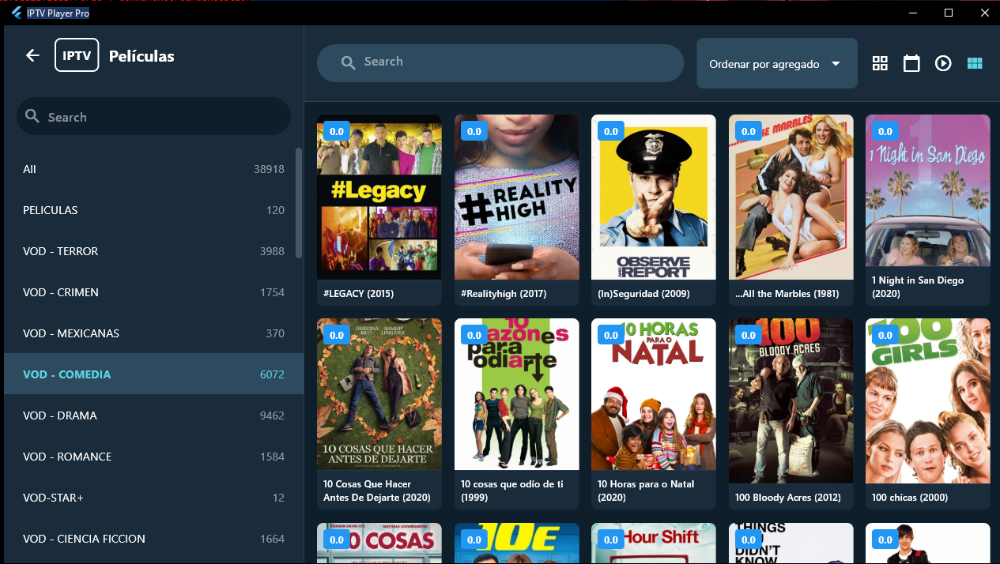

# IPTV Player Pro

Una aplicación profesional de reproducción IPTV construida con Flutter, inspirada en TiviMate.


## 📸 Capturas de Pantalla

<div align="center">
  
  
</div>

<div align="center">
  
  
</div>

## ✨ Características

### 📺 Reproducción
- **TV en Vivo**: Visualiza canales en tiempo real con interfaz de 3 columnas (categorías, canales, reproductor)
- **Películas VOD**: Explora y reproduce películas organizadas por categorías
- **Series**: Navega por temporadas y episodios con información detallada
- **Controles de video**: Barra de progreso, +10/-10 segundos, control de volumen, pantalla completa

### 🎯 Gestión de Contenido
- **Soporte M3U/M3U8**: Importa playlists desde URL o archivo local
- **Autenticación Xtream Codes**: Compatible con servicios IPTV populares
- **Múltiples playlists**: Gestiona varias listas simultáneamente
- **Sistema de favoritos**: Marca tus canales y contenidos preferidos
- **Búsqueda avanzada**: Filtra por nombre, categoría o grupo

### 💾 Almacenamiento
- **Base de datos Isar**: Almacenamiento local ultrarrápido y eficiente
- **Caché de contenido**: Reduce tiempo de carga en inicios subsecuentes
- **Sin conexión**: Accede a tu historial y favoritos offline

### 🎨 Interfaz
- **Diseño moderno**: Inspirado en TiviMate con Material Design 3
- **Responsive**: Adaptable a diferentes tamaños de ventana
- **Tema oscuro**: Interfaz optimizada para visualización prolongada
- **Idioma español**: Completamente localizado

## 🛠️ Tecnologías Utilizadas

- **Flutter**: Framework de UI multiplataforma
- **media_kit**: Reproductor de video basado en libmpv/FFmpeg
- **Isar**: Base de datos NoSQL local de alta velocidad
- **Material Design 3**: Diseño moderno y adaptable

## 📋 Requisitos Previos

### 🪟 Windows
- Windows 10 o superior
- **Modo Desarrollador activado** (requerido para compilar)
  - Ejecuta: `start ms-settings:developers`
  - Activa "Modo de desarrollador"

### 🔧 Herramientas de Desarrollo

1. **Flutter SDK**: [Descargar](https://docs.flutter.dev/get-started/install/windows)
   - Extrae en `C:\src\flutter`
   - Agrega al PATH: `C:\src\flutter\bin`

2. **Visual Studio 2022** (Build Tools)
   - Con componente "Desktop development with C++"
   - [Descargar](https://visualstudio.microsoft.com/downloads/)

3. **Verifica la instalación**:
```bash
flutter doctor
```

## 🚀 Instalación y Ejecución

### 1️⃣ Clonar el repositorio
```bash
git clone https://github.com/TU_USUARIO/flutter-iptv-player.git
cd flutter-iptv-player
```

### 2️⃣ Instalar dependencias
```bash
flutter pub get
```

### 3️⃣ Generar código de Isar
```bash
flutter pub run build_runner build --delete-conflicting-outputs
```

### 4️⃣ Ejecutar la aplicación

**Modo desarrollo:**
```bash
flutter run -d windows
```

**Compilar Release:**
```bash
flutter build windows --release
```

El ejecutable estará en: `build\windows\x64\runner\Release\iptv_player.exe`

## 📦 Empaquetar como MSIX (Windows Store)

1. Configura el archivo `pubspec.yaml` con tu información:
   - publisher_display_name
   - identity_name
   - logo_path

2. Genera el paquete MSIX:
```bash
flutter pub run msix:create
```

El paquete MSIX estará en: `build\windows\x64\runner\Release\`

## 📖 Guía de Uso

### 1. Agregar una Playlist

Desde el dashboard principal, haz clic en **"Listas"** y luego en el botón **"+"**:

**Playlist M3U simple:**
```
Nombre: Mi Lista IPTV
URL: http://example.com/playlist.m3u
```

**Playlist con Xtream Codes:**
```
Nombre: Mi Servicio Premium
URL: http://server.com:8080/get.php?username=usuario&password=clave&type=m3u_plus
```

### 2. Navegar por el Contenido

- **TV EN VIVO**: Accede a canales en tiempo real con vista de 3 columnas
  - Columna izquierda: Categorías
  - Columna central: Lista de canales
  - Columna derecha: Reproductor integrado

- **PELÍCULAS**: Explora el catálogo VOD organizado por categorías

- **SERIES**: Navega por series, temporadas y episodios

### 3. Reproducción

**TV en Vivo:**
- Selecciona una categoría → Elige un canal → Se reproduce automáticamente
- Botón de pantalla completa para expandir el reproductor

**Películas/Series:**
- Abre en reproductor de pantalla completa
- Controles disponibles:
  - Play/Pausa
  - Barra de progreso (arrastra para buscar)
  - +10/-10 segundos
  - Control de volumen
  - Pantalla completa

## 📁 Estructura del Proyecto

```
lib/
├── models/           # Modelos de datos (Channel, Playlist, Series)
├── services/         # Servicios (Database, M3U Parser, Series Parser)
├── screens/          # Pantallas de la aplicación
│   ├── dashboard_screen.dart
│   ├── live_tv_screen.dart
│   ├── content_grid_screen.dart
│   ├── series_grid_screen.dart
│   ├── video_player_screen.dart
│   └── playlist_manager_screen.dart
└── main.dart         # Punto de entrada de la aplicación
```

## 🔮 Características Pendientes

- [ ] Sistema de perfiles de usuario con UI
- [ ] EPG (Guía electrónica de programación)
- [ ] Grabación de canales
- [ ] Timeshift (pausa en vivo)
- [ ] Modo Picture-in-Picture
- [ ] Controles parentales
- [ ] Temas personalizables
- [ ] Sincronización en la nube
- [ ] Soporte para subtítulos
- [ ] Audio multicanal

## 🐛 Solución de Problemas

### Error: "flutter: command not found"
- Verifica que Flutter esté en tu PATH
- Reinicia tu terminal o PowerShell

### Error: "Building with plugins requires symlink support"
- Activa el Modo Desarrollador en Windows
- Ejecuta: `start ms-settings:developers`

### Error al compilar Isar
```bash
flutter pub run build_runner clean
flutter pub run build_runner build --delete-conflicting-outputs
```

### Error de reproducción de video
- Asegúrate de que la URL del canal sea válida
- Verifica tu conexión a internet
- Algunos canales pueden requerir VPN

### Problemas con caracteres especiales (ñ, tildes)
- La app maneja automáticamente UTF-8 y Latin1

## 📄 Licencia

Este proyecto es de código abierto y está disponible bajo la licencia MIT.

## 👏 Créditos

Inspirado en **TiviMate IPTV Player** y creado desde cero con Flutter.

Desarrollado por **Diego**

---

⭐ Si te gusta este proyecto, dale una estrella en GitHub!

> 💡 **Nota**: Solo soy una persona trabajando en este proyecto, así que lo iré actualizando poco a poco cuando tenga tiempo, ya que solo lo hago en mis ratos libres.
