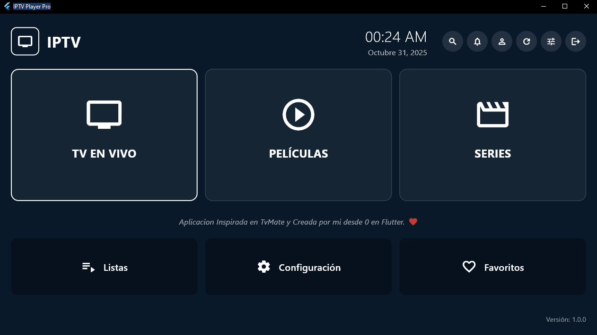

# IPTV Player Pro

**🇬🇧 English** | **[🇪🇸 Español](README.md)**

A professional IPTV playback application built with Flutter, inspired by TiviMate.



## 📸 Screenshots

### 🎨 Theme System
<div align="center">
  
  
</div>

### 🎬 Movies - Original and Netflix Themes
<div align="center">
  
  
</div>

<div align="center">
  
  
</div>

### 📺 Series - Original and Netflix Themes
<div align="center">
  
  
</div>

<div align="center">
  
  
</div>

### 📡 Live TV and Video Player
<div align="center">
  
  
</div>

<div align="center">
  
</div>

## ✨ Features

### 📺 Playback
- **Live TV**: View live channels with a 3-column interface (categories, channels, player)
- **VOD Movies**: Explore and play movies organized by categories
- **Series**: Navigate through seasons and episodes with detailed information
- **Advanced video controls**:
  - Progress bar with seeking
  - Quick skip: +10/-10 seconds
  - Volume control with slider
  - Multiple audio tracks
  - Configurable subtitles
  - **True fullscreen mode** (hides Windows taskbar)
  - Keyboard shortcuts (Space, Arrows, F/F11, Escape)

### 🎯 Content Management
- **M3U/M3U8 Support**: Import playlists from URL or local file
- **Xtream Codes Authentication**: Compatible with popular IPTV services
  - Full Xtream Codes API support
  - Lazy loading of series episodes (ultra-fast)
  - Automatic categories for Live TV, Movies, and Series
- **Multiple playlists**: Manage several lists simultaneously
- **Favorites system**: Mark your preferred channels and content
- **Advanced search**: Filter by name, category, or group

### 💾 Storage
- **Isar Database**: Ultra-fast and efficient local storage
- **Content caching**: Reduces loading time on subsequent launches
- **Offline access**: Access your history and favorites offline

### 🎨 Interface
- **Dynamic Theme System**: Switch between multiple themes instantly
  - **Original Theme**: Cyan/blue design inspired by TiviMate
  - **Netflix Theme**: Netflix-style with red/dark colors
  - Automatically saved preferences
- **Modern design**: Material Design 3 with Netflix-style layouts
- **Fully Responsive**: Adapts to mobile, tablet, and desktop
- **Multi-language**: Spanish, English, Chinese (简体中文), and Russian (Русский)
- **Adaptive Navigation**:
  - Mobile: Side menu (Drawer)
  - Tablet/Desktop: Full navigation bar

### ⭐ Ratings
- **Smart ratings**: 3-tier system for obtaining ratings
  - OMDb API (no key required)
  - TMDB API (optional)
  - Pseudo-random generator (automatic fallback)
- **Visual indicators**: Badges with colors based on rating
- **No limits**: The app works completely without configuring APIs

## 🛠️ Technologies Used

- **Flutter**: Cross-platform UI framework
- **media_kit**: Video player based on libmpv/FFmpeg
- **Isar**: High-speed local NoSQL database
- **Material Design 3**: Modern and adaptive design

## 📋 Prerequisites

### 🪟 Windows
- Windows 10 or higher
- **Developer Mode enabled** (required to build)
  - Run: `start ms-settings:developers`
  - Enable "Developer Mode"

### 🔧 Development Tools

1. **Flutter SDK**: [Download](https://docs.flutter.dev/get-started/install/windows)
   - Extract to `C:\src\flutter`
   - Add to PATH: `C:\src\flutter\bin`

2. **Visual Studio 2022** (Build Tools)
   - With "Desktop development with C++" component
   - [Download](https://visualstudio.microsoft.com/downloads/)

3. **Verify installation**:
```bash
flutter doctor
```

## 🚀 Installation and Execution

### 1️⃣ Clone the repository
```bash
git clone https://github.com/DiegoRosales123/flutter-iptv-player.git
cd flutter-iptv-player
```

### 2️⃣ Install dependencies
```bash
flutter pub get
```

### 3️⃣ Generate Isar code
```bash
flutter pub run build_runner build --delete-conflicting-outputs
```

### 4️⃣ Run the application

**Development mode:**
```bash
flutter run -d windows
```

**Build Release:**
```bash
flutter build windows --release
```

The executable will be at: `build\windows\x64\runner\Release\iptv_player.exe`

### 5️⃣ Configure APIs (Optional - for real ratings)

The application includes a rating system for movies and series. It works in three ways:

1. **OMDb API** (No key required - Recommended)
2. **TMDB API** (Optional key for additional results)
3. **Rating generator** (Automatic fallback)

To use the APIs:

1. Copy the example configuration file:
```bash
copy config.json.example config.json
```

2. (Optional) Get your TMDB key:
   - Go to https://www.themoviedb.org/settings/api
   - Create a free account if you don't have one
   - Copy your **API Key**
   - Open `config.json` and replace `YOUR_TMDB_API_KEY_HERE` with your key

3. The `config.json` file **is not uploaded to GitHub** (it's in `.gitignore`) - your keys are safe

**Example `config.json`:**
```json
{
  "apis": {
    "tmdb": {
      "apiKey": "your_key_here",
      "baseUrl": "https://api.themoviedb.org/3"
    },
    "omdb": {
      "baseUrl": "http://www.omdbapi.com"
    }
  }
}
```

## 📦 Package as MSIX (Windows Store)

1. Configure the `pubspec.yaml` file with your information:
   - publisher_display_name
   - identity_name
   - logo_path

2. Generate the MSIX package:
```bash
flutter pub run msix:create
```

The MSIX package will be at: `build\windows\x64\runner\Release\`

## 📖 Usage Guide

### 1. Add a Playlist

From the main dashboard, click on **"Listas"** (Lists) and then the **"+"** button:

**Simple M3U Playlist:**
```
Name: My IPTV List
URL: http://example.com/playlist.m3u
```

**Playlist with Xtream Codes:**
```
Name: My Premium Service
URL: http://server.com:8080/get.php?username=user&password=pass&type=m3u_plus
```

### 2. Navigate Content

- **LIVE TV**: Access live channels with a 3-column view
  - Left column: Categories
  - Center column: Channel list
  - Right column: Integrated player

- **MOVIES**: Explore the VOD catalog organized by categories

- **SERIES**: Navigate through series, seasons, and episodes

### 3. Playback

**Live TV:**
- Select a category → Choose a channel → Plays automatically
- Fullscreen button to expand the player

**Movies/Series:**
- Opens in fullscreen player
- Available controls:
  - Play/Pause (Space)
  - Progress bar (drag to seek)
  - Rewind/Forward 10 seconds (← → Arrows)
  - Volume control (↑ ↓ Arrows)
  - Audio track selector
  - Subtitle selector
  - **True fullscreen mode** (F or F11) - Hides Windows taskbar
  - Back/Exit fullscreen (Escape)

## 📁 Project Structure

```
lib/
├── models/           # Data models (Channel, Playlist, Series)
├── services/         # Services (Database, M3U Parser, Series Parser)
├── screens/          # Application screens
│   ├── dashboard_screen.dart
│   ├── live_tv_screen.dart
│   ├── content_grid_screen.dart
│   ├── series_grid_screen.dart
│   ├── series_detail_screen.dart
│   ├── video_player_screen.dart
│   └── playlist_manager_screen.dart
└── main.dart         # Application entry point
```

## 🔮 Pending Features

- [x] User profile system with UI
- [x] EPG (Electronic Program Guide)
- [x] True fullscreen mode (hides taskbar)
- [x] Multiple audio tracks
- [x] Subtitle support
- [x] Xtream Codes API integration
- [x] Lazy loading for series episodes
- [x] Customizable themes (Original and Netflix)
- [ ] Channel recording
- [ ] Timeshift (pause live TV)
- [ ] Picture-in-Picture mode
- [ ] Parental controls
- [ ] Cloud sync

## 🔐 Security and Privacy

### API Configuration
- The `config.json` file with your API keys **is not uploaded to GitHub** (it's in `.gitignore`)
- Only the `config.json.example` file is publicly shared as a reference
- Your API keys remain secure on your local machine
- The app works completely without keys - it's optional

### Local Data
- All information (channels, favorites, history) is stored **locally** on your device
- No data is sent to external servers except:
  - Requests to rating APIs (OMDb, TMDB) to obtain ratings
  - Playlist downloads from the URL you provide
- The Isar database is encrypted and local-access only

## 🐛 Troubleshooting

### Error: "flutter: command not found"
- Verify that Flutter is in your PATH
- Restart your terminal or PowerShell

### Error: "Building with plugins requires symlink support"
- Enable Developer Mode in Windows
- Run: `start ms-settings:developers`

### Error when compiling Isar
```bash
flutter pub run build_runner clean
flutter pub run build_runner build --delete-conflicting-outputs
```

### Video playback error
- Make sure the channel URL is valid
- Check your internet connection
- Some channels may require VPN

### Issues with special characters (ñ, accents)
- The app automatically handles UTF-8 and Latin1

## 📄 License

This project is open source and available under the MIT License.

## 👏 Credits

Inspired by **TiviMate IPTV Player** and built from scratch with Flutter.

Developed by **Diego**

---

⭐ If you like this project, give it a star on GitHub!

> 💡 **Note**: I'm just one person working on this project, so I'll be updating it gradually when I have time, as I only do it in my spare time.
